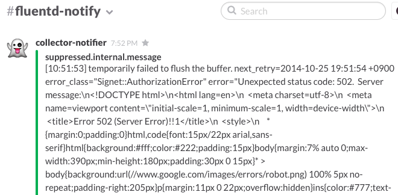
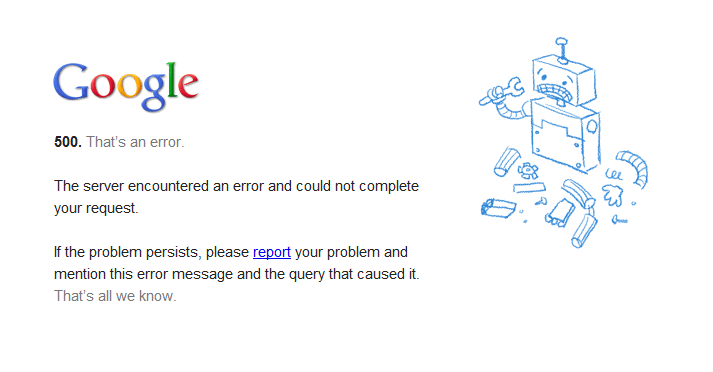
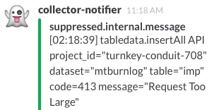
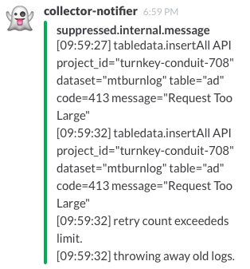

# Redshift
# vs
# BigQuery

AWS Casual Talks #3 @ Cookpad

id:myfinder

___

# 先にお知らせ

___

# MySQL Casual Talks vol.7
- 12/12(金)開催
- Zussar力が低くて応募できないので後でどうにかします
- トーク/LTネタがある方はお気軽に^^

---

# 注意事項
## AWS Casual だけど
## BigQuery のBK話をします

---

## 先にまとめ
### 前述の通り我々は BigQuery を選択しました
### スモールデータほど BigQuery は活用できます
### ほんとうに Big になってきたら Redhift か Hadoop おじさんを採用しましょう

---

# 対象のサービス
## http://mtburn.jp/

___

## メディア企業の皆様
# どしどしお申込み
# ください

___

# 再び
# 社会人としての
# 勤めを果たした

---

## 課題
いままで Hadoop おじさんたちにお願いしていたログ集計を開発者側でコントロールしたい

でもログ置場や集計基盤の設計構築に悩みたくないわがままボディ

---

## というのを解決したい

---

# ログ置場
## S3で十分

___

# ログ集計
## S3から読んで〜
## というのはツライ

___

# ログ集計
## 集計対象は増えるけど
## エンジニアはすぐに増えない

___

# 候補に挙げたやつ
## ~~EMR~~
## Redshift
## BigQuery

---

# Redshift
## fast
## cost effective
## in less ops

___

# Redshift
- (ちゃんと設計すれば)fast
- (ちゃんと設計すれば)cost effective
- (ちゃんと設計すれば)in less ops

___

# Redshift
## SORTKEY -> 時間
## DISTKEY -> さてどうしよう

___

## fluent-plugin-redshift
### fluentd -> S3 -> Redshift

# 冗長感

---

# BigQuery
## modestly fast
## pay per use
## no ops

___

# BigQuery
- (何も考えずとも)modestly fast
- (何も考えずとも)pay per use
- (何も考えずとも)in less ops

___

## fluent-plugin-bigquery
### fluentd -> BigQuery

# シンプル

___

## BigQuery
最近 timestamp 型をサポート

fluent-plugin-bigquery も 0.2.4 からサポート

---

# Compare
|  cmp   |  Redshift   |     BigQuery     |
|:------:|:-----------:|:----------------:|
| speed  |    fast     |     modestly     |
|  cost  | controlable |  uncontorolable  |
|  ops   |  requeired  |       free       |
| import | inefficient |    nefficient    |

---

# BigQuery :)
## そして
## 我々は BigQuery を選んだ
## これが辛い戦いの
## 始まりだとも知らず

---

# BigQueryェ...

___

## "500 Backend Error"
出まくる

とにかく出まくる

___

## "500 Internal Error"
時々でる

思い出したように出る

___

## "500 Error"
謎のメッセージ

___

## "500 Error"
API コールに HTML を返してくる

___

# おちゃめ♡
___

# ここまでは
# リトライで
# 問題ない

___

# 413
# Request
# Too
# Large

___

## "413 Request Too Large"

___

# 失敗した
# 失敗した
# 失敗した

___

# 結果

___

# 消える＼(^o^)／

___

# 対策1
- 発生しづらいパラメタに調整
 - http://qiita.com/najeira/items/74799a67ac21c6b13415
 - こうしてから起こりにくくなりました

___

# 対策2
- 欠落したログを S3 から復帰させる
 - そういうスクリプトを書いておく

___

# 欠点
- ログの重複が許されない用途ではこの対策は不可能

---

# 結果
数々のアレな状況を乗り越えて

今は割と不自由なくお気楽ログ集計ライフを送っています

---

## まとめ
### 現在は BigQuery を選択して利用しています
### そんなに Big じゃない人たちには BigQuery 楽でいいかと思います
### ほんとうに Big になって設計や細かい管理が必要になってきたら Redhift か Hadoop おじさんを採用しましょう

___

# おわり
