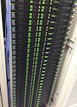
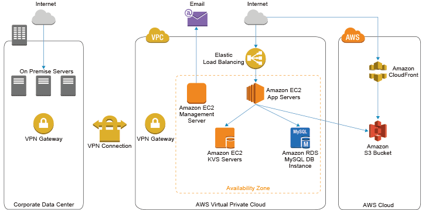
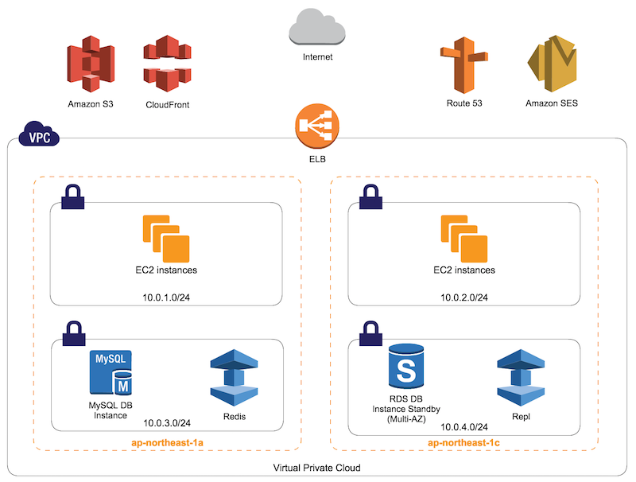
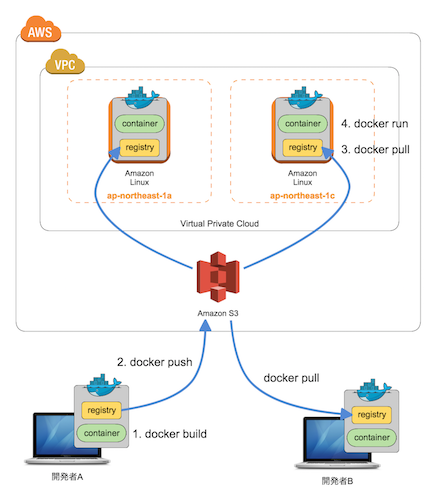
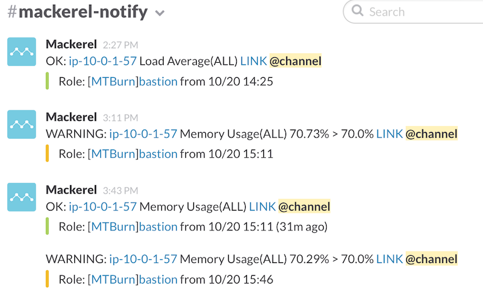

# 僕らのAWS移行記
AWS Casual Talks #3 @ Cookpad

id:myfinder

___

# 自己紹介
- id:myfinder
 - まいんだー
- エム・ティー・バーン株式会社
 - サーバサイド / Android

___

# 経緯
## 星野さんに反応したら
## 星さんから連絡が来た

---

# 先にお知らせ

___

# MySQL Casual Talks vol.7
- 12/12(金)開催
- 参加登録 -> いまから
- トーク/LTネタがある方はお気軽に^^

---

# 今日話すこと
- どオンプレで作られたサービスを AWS に移設しました
- 移設するにあたって、大きく運用環境を変えました
- AWS x Mackerel でとても捗っています

---

# 移行前の環境
オンプレ+S3/CloudFront

  

___

- 海外展開で初めてEC2/ELBを使い始めた程度
 - AWS Summit 2013(http://aws.amazon.com/jp/solutions/case-studies/freakout/)

___

# 移行前の環境
- Single Segment
- データセンター提供のマネージドDNS
- 箱物ロードバランサ / 大手メーカー製サーバ / 一部自作機
- CentOS 6.x / cobbler / puppet
- Hive / MapReduce
- MySQL / Redis おじさんが用意 / 運用
- Nagios / CloudForecast
- 足元のディスクに吐いたログをでっかいサーバに収集して集計というWeb1.0

___

# よくあるオンプレ環境でした :p

---

# 懸案
## "調達"と"実装スピード"
## インフラおじさんへの依存

___

# 本音
## オンプレに疲れた

---

# 移行で変えたこと
- アプリケーションサーバのつくり
- Single Segment -> Multi-AZ
- マネージドDNS -> Route53
- 箱物LB -> Elastic LoadBalancing
- 物理サーバ -> EC2
- CentOS -> Ubuntu
- cobbler -> cloud-init
- puppet -> ansible
- MapReduce/Hive -> BigQuery
- MySQL -> RDS(MySQL)
- Redis -> ElastiCache(Redis)
- Docker を一部でつかい始める
- Nagios+CloudForecast -> Mackerel

___

# つまり
# アプリ以外全部
# 変えた

___

# アプリケーションサーバ
- 足元のストレージに吐いたログをscpとかで収集して集計していた
- アプリケーションからfluentdへログを投げる形に

___

# Single Segment
過去の例はオンプレ事情を勘案して構築した

http://aws.amazon.com/jp/solutions/case-studies/freakout/

___

# Multi-AZ
今回構築したのはこんな感じ

___

# Multi-AZ
- 4セグメント
- 後ろのセグメントはマネージドサービス用

___

## マネージドDNS -> Route53
- 履歴機能とかはあったけど余りプログラマティックではなかった
- Roadworkerで履歴管理できるのでさくっと引越

___

## 箱物LB -> Elastic LoadBalancing
- ハードウェアロードバランサにはとても救われた
- 一方でハードウェアロードバランサおじさん業が必要になる
- 最初からキャパシティを見切れない環境では新規に買うのもためらわれる
- SSL を箱で処理してたけど ELB も SSL 受け持ってくれるので特に問題なし

___

## 物理サーバ -> EC2
- NAT インスタンス不使用
- すべての EC2 インスタンスに Public IP を付与
- アクセスコントロールは Security Group で確保
- 個別のインスタンスに名前は付けない
 - よって内部 DNS も廃止 / IP 付与も DHCP 任せ

___

## 命名が必要なものは
## マネージドサービスを使う
## or
## EIP をつけて個別管理

___

## CentOS -> Ubuntu
- 事例の時は独自の AMI を作っていた
 - update への追随がダルくなるのでやめたかった
 - AWS でまともな CentOS を使おうと思うと Rightscale の AMI を魔改造する羽目になる
- 標準提供のものと付き合う方が他のメンバーにも理解が早い
- 独自の yum リポジトリとか作っていたけどそういうのを捨てた
 - いうほど独自リポジトリ必要ですか？

___

# まだCentOSで
# 消耗してるの?

___

## cobbler -> cloud-init
- EC2 の場合素直にセットアップしたいことをシェルスクリプトで書いておけば良い
- ハードウェアの種類が多いと cobbler の snippet がカオス化したりする
 - ex. ethx で良かったはずの記述が DELL のサーバ買った瞬間 enx の対応を迫られる
 - ex. Hadoop のために 2U のサーバみたいなのを買うとどでかいパーティションをほげほげする対応に迫られる
- そもそも後述の BigQuery に移行するから関係なくなった :p

___

## puppet -> Ansible
- chef-soloも検討したけどセットアップで複雑なことをやる必要がなくなってきた
 - yaml を書くだけでいい Ansible の方がメンバーの学習が早いので採用
 - if とか必要ない(必要な状況になったらおとなしく role を分ける)
 - 徹底して各 role が受け持つ範囲を小さくする
 - 複雑になり(そう|なる)のは、問題の切り分けができていないだけ

___

# Ansible最大の利点
## Dynamic Inventory 機能で Mackerel 連携が簡単
> $ ansible -i mackerel.py all -m ping -u foobar

___

## Hive/MapReduce -> BigQuery
- ついに実用段階に入った BigQuery
 - fluent-plugin-bigquery 0.2.4 で timestamp 型サポートが入った

- Redshift と比較検討したけど BigQuery のほうが要件に合ってた
 - AWS でもこういうの出てくれば検証して乗り換えたい

___

## MySQL -> RDS(MySQL)
- 事例のタイミングではオペレーションが変わるのを避けたかった
- オンプレ脳で作ったネットワーク&オンプレとの連携を考えなくてよくなったので活用
- MySQL Casualもよろしくね!!

___

## Redis -> ElastiCache(Redis)
- 冗長化や自動バックアップ対応なので独自構築をやめた
- auto failover サポートが発表されてさらに安心

___

## Dockerを使いはじめる
- ついに実用段階に入った Docker
 - fluentd の collector を Docker で動かしています
- Deploy は cap で docker pull -> docker stop -> docker run するだけ
> $ cap deploy:container:td-agent
- graceful restart が必要なものの利用にはまだ課題がある

___

## Dockerを使いはじめる
- S3 バックエンドでプライベートレジストリを構築
 - http://aws.typepad.com/sajp/2014/06/eb-docker-private-repo.html

___

## Nagios + CloudForecast -> Mackerel + Slack
- オンプレではサーバリストの管理をどうするこうするという問題がついて回ってきていた
- EC2移行に際して、roleベースでの管理に移行してサーバに命名することをやめた
 - 個別のサーバにログインするオペレーションがあまりなくなった

___

# Mackerel + Slack

携帯がアラートメールでうめつくされるみたいなのもなくなった

---

# AWS x Mackerel
- 実際運用しているやつ
 - https://mackerel.io/

___

# AWS x Mackerel
# awesome

---

# まとめ

- どオンプレで作られたサービスを AWS に移設しました
- 移設するにあたって、大きく運用環境を変えました
- AWS x Mackerel でとても捗っています

---

# 質疑など?

---

# おわり
