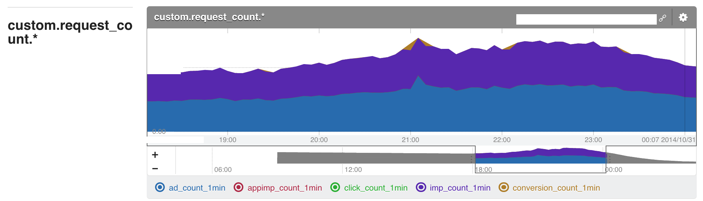

# 僕らのAWS移行記
AWS Casual Talks #3 @ Cookpad

id:myfinder

___

# 経緯
## <span style="color: red">星野</span>さんに反応したら
## <span style="color: red">星</span>さんから連絡が来た

___

# 自己紹介
- id:myfinder
 - まいんだー
- <span style="color: red">エム・ティー・バーン</span>株式会社
 - サーバサイド / Android

___

## AWS 利用経験
- 2012年初頭に VPC/EC2/ELB を使い始めた程度の初心者
 - http://aws.amazon.com/jp/solutions/case-studies/freakout/
- AWS Summit 2013に登壇して<span style="color: red">自作サーバの話</span>をする程度の初心者


___

# <span style="color: red">カジュアル</span>ユーザ
# です :)

---

# 先にお知らせ

___

# MySQL Casual Talks vol.7
- <span style="color: red">12/12(金)</span>開催
- 参加登録 -> <span style="color: red">いまから</span>
- トーク/LTネタがある方はお気軽に^^

---

# 今日話すこと
- <span style="color: red">"どオンプレ環境"</span>で作ったサービスを最近 AWS に移設しました
- 移設するにあたって、運用環境を<span style="color: red">大きく</span>変えました
- <span style="color: red">AWS x Mackerel</span> でとても捗っています

___

# 対象のサービス
## http://mtburn.jp/

___

## メディア企業の皆様
# どしどし<span style="color: red">お申込み</span>
# ください

---

# 移行前の環境
オンプレ+S3/CloudFront(とか他のCDN)

___

# 移行前の環境
- <span style="color: red">Single Segment</span>
- データセンター提供のマネージドDNS
- 箱物ロードバランサ / 大手メーカー製サーバ / 一部自作機
- <span style="color: red">CentOS</span> 6.x / cobbler / puppet / RackTables
- <span style="color: red">Hadoop 担当</span>が構築 / 運用
- <span style="color: red">MySQL/Redis 担当</span>が構築 / 運用
- Nagios / CloudForecast / GrowthForecast
- 足元のディスクに吐いたログを<span style="color: red">でっかいサーバに収集</span>して集計

___

# よくあるオンプレ環境でした :p

---

# 抱えていた懸案
## <span style="color: red">__"調達"__</span>と<span style="color: red">__"実装スピード"__</span>

___

## <span style="color: red">急速</span>に立ち上がっている状況


___

# オンプレ
# <span style="color: red">すぐ調達</span>できない
# 厳しい＞＜

---

## 移行で変えた点
- 足元にログ吐くな
- Single Segment -> Multi-AZ
- マネージドDNS -> Route53
- 箱物LB -> Elastic LoadBalancing
- 物理サーバ -> EC2
- CentOS -> Ubuntu
- cobbler -> cloud-init
- puppet -> ansible
- MapReduce/Hive -> BigQuery
- MySQL -> RDS(MySQL)
- Redis -> ElastiCache(Redis)
- 一部 Docker でコンテナデプロイ
- Nagios+CloudForecast -> Mackerel

___

# つまり
# <span style="color: red">アプリ以外</span>全部

___

# アプリサーバ
- 足元のストレージに吐いたログをscpとかで収集して集計していた
- fluentd でログを各所に投げる形に
 - fluentd 自体のログも他に投げる


___

## Single Segment
過去の例はオンプレ<span style="color: red">事情</span>の考慮が必要だった


http://aws.amazon.com/jp/solutions/case-studies/freakout/

___

## Multi-AZ
今回構築したのはこんな感じ


___

# Multi-AZ
- 4セグメント
- 後ろのセグメントはマネージドサービス用
 - RDSとかElastiCacheとか用

___

## マネージドDNS -> Route53
- 履歴機能とかはあったけど余りプログラマティックではなかった
 - ヤバい点は <span style="color: red">NS レコードを変更できない(！)</span>こと
- Roadworker を使えば git で管理できるので急いで引越

___

## 箱物LB -> Elastic LoadBalancing
- ハードウェアロードバランサにはとても救われた
- 一方でハードウェア<span style="color: red">ロードバランサおじさん業</span>が必要になる
- 最初からキャパシティを見切れない環境では新規に買うのもためらわれる
- SSL を箱で処理してたけど ELB も SSL 受け持ってくれるので特に問題なし

___

## 物理サーバ -> EC2
- NAT インスタンス不使用
- すべての EC2 インスタンスに Public IP を付与
- アクセスコントロールは Security Group で設定
- 個別のインスタンスに名前は付けない
 - したがって<span style="color: red">内部 DNS 廃止</span> / IP 付与も DHCP 任せ

___

## <span style="color: red">命名</span>が必要なものは
## マネージドサービスを使う
## or
## EIP をつけて個別管理

___

## CentOS -> Ubuntu
- 事例の時は独自の AMI を作っていた
 - <span style="color: red">update への追随がダルくなる</span>のでやめたかった
 - AWS でまともな CentOS を使おうと思うと Rightscale の AMI を魔改造する羽目になる
- 標準提供で一般的なディストロの方がメンバーの理解が早い
 - 使ってた Travis CI も Ubuntu だし
- 独自の yum リポジトリとか作っていたけどそういうのを捨てた
 - 思い切って捨ててみたら実はそれほど必要なかった

___

## cobbler -> cloud-init
- 素直に<span style="color: red">シェルスクリプト</span>で書いておけば良い
- ハードウェアの種類が多いと cobbler の snippet がカオス化したりする
 - ex. ethx で良かったはずの記述が DELL のサーバ買った瞬間 enx の対応を迫られる
 - ex. Hadoop のために 2U のサーバみたいなのを買うとどでかいパーティションをほげほげする対応に迫られる
- そもそも後述の BigQuery に移行したからこれは関係なくなった :p

___

## puppet -> Ansible
- chef-soloも検討したけど複雑なことをやる必要がなくなった
- yaml だけでいい Ansible の方がメンバーの学習が早いので採用
- 徹底して<span style="color: red">各 role が受け持つ範囲を小さくした</span>ので分岐が要らない
- 複雑になり(そう|なる)のは、問題の切り分けができていない可能性大

___

# Ansible最大の利点
## Dynamic Inventory 機能で
## <span style="color: red">Mackerel 連携が簡単</span>
> $ ansible -i mackerel.py all -m ping -u foobar

___

## Hive/MapReduce -> BigQuery
- ついに実用段階に入った BigQuery
 - fluent-plugin-bigquery 0.2.4 で timestamp 型サポートが入った

- Redshift と比較検討したけど BigQuery のほうが要件に合ってた
 - <span style="color: red">続きはLTで</span>

___

## MySQL -> RDS(MySQL)
- 事例の頃はオペレーションが変わるのを避けたかった
- オンプレ脳で作ったネットワーク&オンプレとの連携を考えなくてよくなったので活用
- <span style="color: red">MySQL Casual</span>もよろしくね!!

___

## Redis -> ElastiCache(Redis)
- 冗長化や自動バックアップ対応なので独自構築をやめた
- auto failover サポートが発表されてさらに安心

___

## Dockerを使いはじめる
- ついに実用段階に入った Docker
 - 手始めに fluentd / Norikra をコンテナデプロイしてます
 - 本番で使ってる base image は Docker Hub に up してあります
- Deploy は cap で docker pull -> docker stop -> docker run するだけ
```
$ cap deploy:container:td-agent
$ cap deploy:container:norikra
```
- graceful restart が必要なものの利用にはまだ課題がある
- 後述の private registry は build 忘れや push 忘れが発生しがちなので Docker Hub の有料プランに <span style="color: red">build とレジストリを押し付けたい</span>
- --link とか良い機能だけど人類には早い

___

## レジストリ構成
S3 バックエンドでプライベートレジストリを構築


___

## S3 + Private Registry
- <span style="color: red">SA さんの blog</span> に書いてあった手法
 - http://aws.typepad.com/sajp/2014/06/eb-docker-private-repo.html

___

## RackTables + Nagios + CloudForecast -> Mackerel
- サーバリストの管理/連携で消耗していた
- role ベースでの管理に移行してサーバに<span style="color: red">命名することをやめた</span>
 - 個別のサーバにログインするオペレーションは基本しない
- <span style="color: red">サーバ情報管理の中心を Mackerel </span>にした

___

# Mackerel + Slack


<span style="color: red">携帯がアラートメールでうめつくされる</span>みたいなのもなくなった

___

## <span style="color: green">"デフォルトでSlack"</span>


---

# AWS x Mackerel
- 実際運用しているやつから抜粋

___

# グラフの<span style="color: red">連続性</span>

___

## 当初<span style="color: red">8ノード</span>で運用開始


___

## その後<span style="color: red">4ノード</span>に変更


___

## roleベースでグラフは<span style="color: red">継続</span>


___

# CloudWatch 連携

___

## 公式の手順で<span style="color: red">カジュアル</span>


___

# <span style="color: red">Norikra</span>
# to
# Mackerel

___

## <span style="color: red">fluent-plugin-(norikra|mackerel)</span>でイナフ


___

## <span style="color: red">分速</span>で売上/支払を見る


___

## ホスト登録 は
## cloud-init で
## <span style="color: red">mackerel-agent</span> を
## install すればイナフ

___

#  x 
# advance your ops

---

# まとめ

- <span style="color: red">"どオンプレ環境"</span>で作ったサービスをAWSへ移設できました
- 移設するにあたって、運用環境を~~やりたい放題に~~<span style="color: red">大きく</span>変えました
- <span style="color: red">AWS x Mackerel</span> でとても捗っています
- MTBurnはサーバサイド/スマートフォンのエンジニアを<span style="color: red">募集</span>してます
- <span style="color: red">MySQL Casual</span> もよろしくお願いします

---

# 質疑など?

---

# おわり
